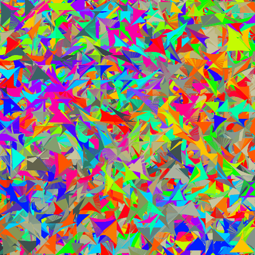

# Abstract Image Player

A Javascript art app.

I could try to explain it, but it is maybe easier to just [play with it](http://coleww.github.io/canvasHax/),
or check out this node bot which uses the code to [post GIFs to Tumblr](http://www.gif-ebooks.tumblr.com).

________________________________________________________________________--

TODO/BUGS/TECHNICAL DEBT:
* UI listener installation is kind of horrendous?

* Abstract away any magic numbers that were hardcoded. Should work same no matter what canvas w/h are.

* SHAPES: draw triangles...octagons...ummm....

* IMAGES: improve the default group of images. Go for maximum variety of colors/etc. LOW FILE SIZE!

* shapesMode: LINES: set ctx.lineWidth to be a remapping of size to ???

* SLITS: converge mode. Fix the weird vetruvian man thing. Shuffle up which corner gets drawn when?

* ERROR: figure out why the node bot sometimes creates non animated gifs (random origin setting is a likely culprit)
//Is the node bot just making >1mb images or something?

* how to ease updates between this & nodebot? share a repo but different branches? or just pain every time i make major changes?

* ADD STYLING TO THE PAGE WTF
* USE STRICT?
* port this to android (X_X)
